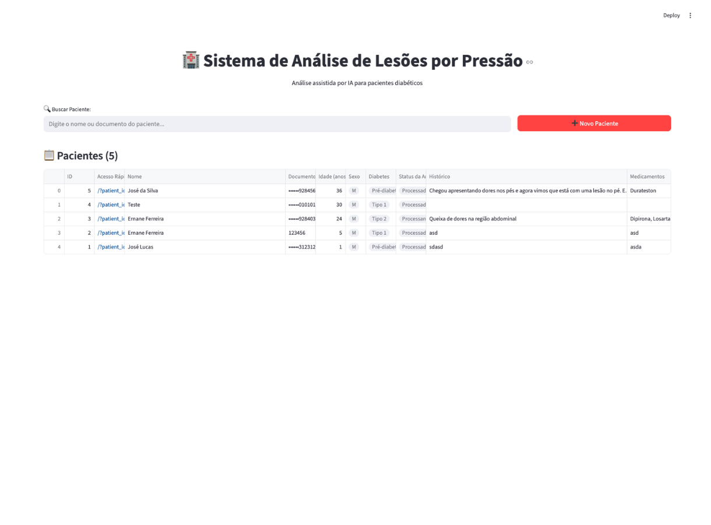
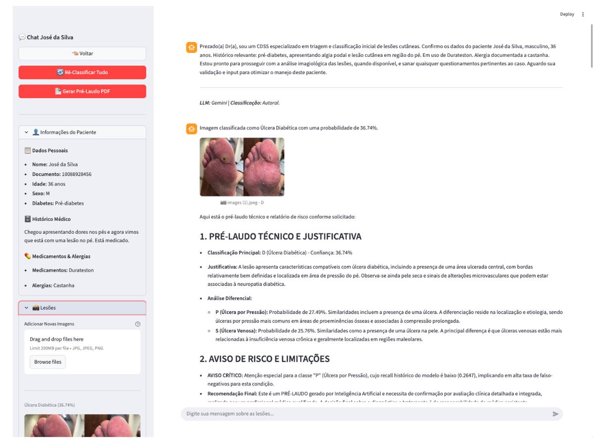

# 🩺 Sistema de IA para Apoio à Decisão Clínica em Lesões

|||
|-|-|
|||
|||

Este projeto consiste em um sistema de apoio à decisão clínica (IA-CDSS) para análise automatizada de lesões de pele, combinando **visão computacional** com **processamento de linguagem natural** para classificar feridas e gerar pré-laudos explicativos.

## 📋 Sobre o Projeto

O sistema foi desenvolvido como parte da disciplina **PPGEEC2328 - Tópicos Especiais em Processamento Embarcado e Distribuído** da **Universidade Federal do Rio Grande do Norte (UFRN)**.

Ele utiliza uma rede neural convolucional (VGG16) com **Transfer Learning** e **Fine-Tuning** para classificar imagens de lesões em seis categorias:

- **D**: Úlcera do Pé Diabético  
- **P**: Úlcera por Pressão  
- **S**: Ferida Cirúrgica  
- **V**: Úlcera Venosa da Perna  
- **N**: Pele Normal  
- **BG**: Fundo

Além disso, integra um **modelo de linguagem (LLM)** para gerar explicações em linguagem natural e pré-laudos em PDF, tornando as predições do modelo mais interpretáveis para profissionais de saúde.

## 🚀 Funcionalidades

- Classificação automática de imagens de lesões dentre às 6 classes;  
- Explicações geradas por LLM para justificar as classificações;
- Geração automática de pré-laudos em PDF;
- Interface web responsiva para uso em celulares, tablets e desktops;
- Dashboard com listagem de pacientes, histórico e status de processamento;
- Armazenamento de dados clínicos e imagens em banco relacional (PostgreSQL);
- Processamento assíncrono de tarefas com Celery e Redis.

## 📊 Resultados

| Etapa de Treinamento | Acurácia Global |
|----------------------|------------------|
| TL (50 épocas)       | 72,22%           |
| TL estendido (94 épocas) | 74,79%       |
| Fine-Tuning (bloco 5) | **75,21%**      |

O modelo final (**fine-tuned**) apresentou melhor desempenho geral, com destaque para a classe **V (Ulcera Venosa)**, que obteve recall de **95,16%**. A classe **P (Ulcera por Pressão)** ainda representa um desafio, sendo frequentemente confundida com outras lesões.

[Exemplo de Pré-Laudo](./assets/exemplo-pre_laudo_jose_da_silva_20251108.pdf).

## 📄 Compreenda

[Relatório de Execução](./assets/relatorio-de-execucao--aplicação-de-tecnicas-de-inteligencia-artificial-para-desenvolvimento-de-sistema-para-analise-de-lesoes-e-suporte-a-decisoes-clinicas.pdf)

## 🗂️ Principais Referências

- **Base de Dados:**
  - [@uwm-bigdata/wound-classification-using-images-and-locations](https://github.com/uwm-bigdata/wound-classification-using-images-and-locations)
- **Publicações Relacionadas:**
  - Patel, Y., Shah, T., Mrinal Kanti Dhar, Zhang, T., Niezgoda, J., Gopalakrishnan, S., & Yu, Z. (2024). Integrated image and location analysis for wound classification: a deep learning approach. Scientific Reports, 14(1). https://doi.org/10.1038/s41598-024-56626-w
  - Anisuzzaman, D. M., Patel, Y., Rostami, B., Niezgoda, J., Gopalakrishnan, S., & Yu, Z. (2022). Multi-modal wound classification using wound image and location by deep neural network. Scientific Reports, 12(1). https://doi.org/10.1038/s41598-022-21813-0