# 🩺 AI-Enabled Digital Healthcare Workflow: Interpretable Wound Triage (AI-CDSS)

This repository contains the source code and implementation for a comprehensive **Artificial Intelligence-assisted Clinical Decision Support System (AI-CDSS)** designed for automated and interpretable chronic wound triage. The system integrates deep convolutional feature extractors with generative Large Language Models (LLMs) to bridge the gap between opaque AI predictions and actionable clinical documentation.

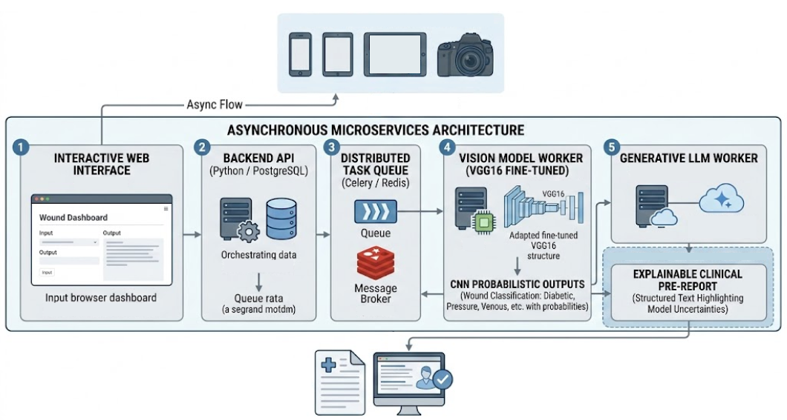
*Figure 1: Overview of the proposed AI-CDSS workflow, from visual data ingestion to LLM-generated reports.*

## 📋 Executive Summary

Accurate triage of chronic wounds (diabetic foot, pressure, venous, and surgical ulcers) is a persistent challenge due to high inter-observer variability and the administrative burden of manual documentation. Our system provides a vision-only workflow that:

  * **Classifies** wound images into six distinct categories using a fine-tuned VGG16 backbone.
  * **Interprets** probabilistic outputs through a "Narrative Interpretability" layer powered by Google Gemini.
  * **Deploys** via a scalable, asynchronous microservices architecture to ensure point-of-care responsiveness.

## 🏗️ System Architecture

The AI-CDSS is engineered to decouple computationally intensive deep learning inference from the user interface, ensuring a seamless experience for healthcare professionals.

### 1\. Vision Engine (VGG16 Backbone)

The system adopts the VGG16 architecture as a stable and transparent feature extractor. To adapt it to wound triage, the ImageNet classifier head was replaced with a custom, highly regularized head consisting of dense layers and dropout to prevent overfitting on specialized medical data.

### 2\. Asynchronous Microservices

The platform is orchestrated via Docker containerization and comprises four primary components:

  * **Frontend:** An interactive, mobile-responsive portal built with Streamlit.
  * **Backend & Database:** A Python-based API utilizing PostgreSQL for clinical traceability and longitudinal follow-up.
  * **Task Queue:** Redis and Celery for managing asynchronous inference tasks.
  * **Generative Worker:** Communicates with the vision engine and the LLM API to produce narrative reports.

### 3\. Data Schema

The database ensures that every generated pre-report is auditable and tied to a specific patient history and model version.

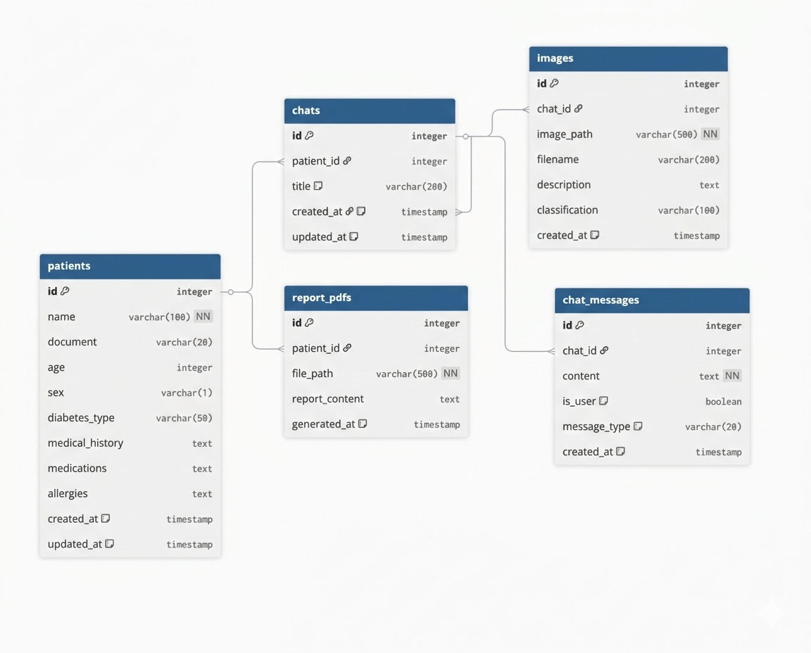
*Figure 2: Entity-relationship diagram illustrating the structure for clinical persistence and auditability.*

## 📊 Methodology & Training Results

The model development followed a three-phase strategy: Transfer Learning (TL), Extended TL with weight restoration, and Specialist Fine-Tuning (FT) of high-level convolutional blocks.

### Learning Dynamics

The system achieved stable convergence through targeted optimization, minimizing the gap between training and validation loss.

| Initial Training (Epochs 1-50) | Extended Training (At Epoch 94) |
| :--- | :--- |
| 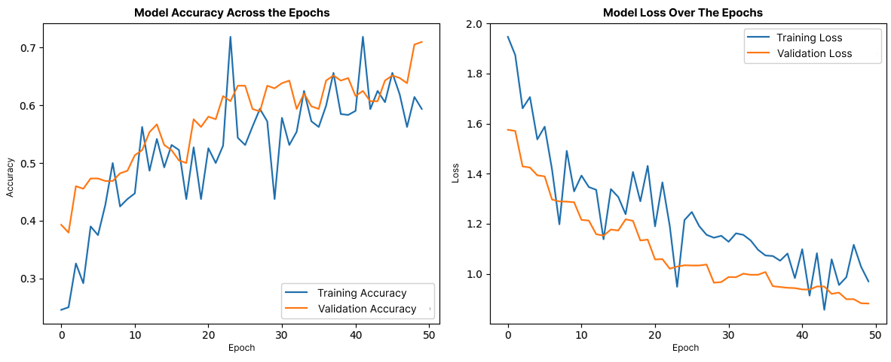| 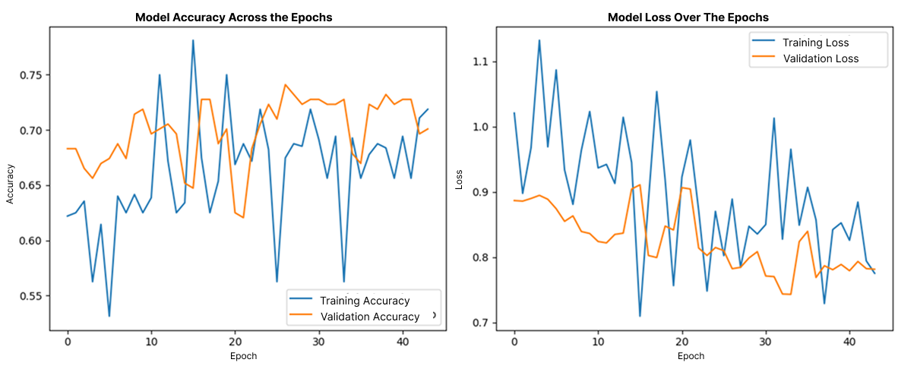 |
| Rapid initial convergence to 72.22% accuracy. | Stabilization at 74.79% accuracy prior to fine-tuning. |

### Performance Specialization

Fine-tuning the `block5` convolutional filters transformed the model into a "venous ulcer specialist," increasing its recall for the most prevalent wound etiology.

  * **Global Accuracy:** 75.21%.
  * **Venous Ulcer Recall:** 95.16%.

| Confusion Matrix (Baseline) | Confusion Matrix (Fine-Tuned) | F1-Score Comparison |
| :--- | :--- | :--- |
| 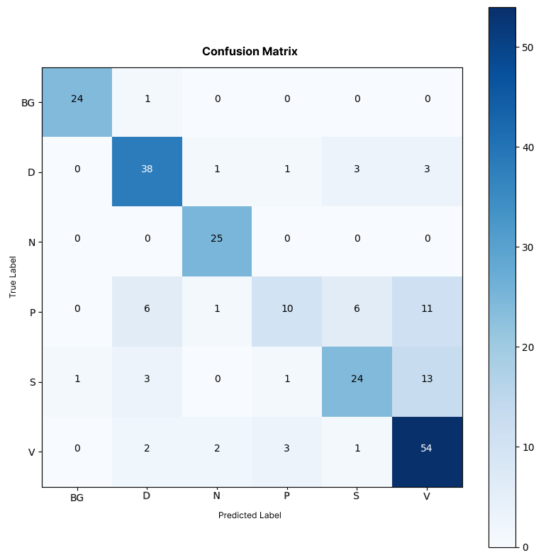 | 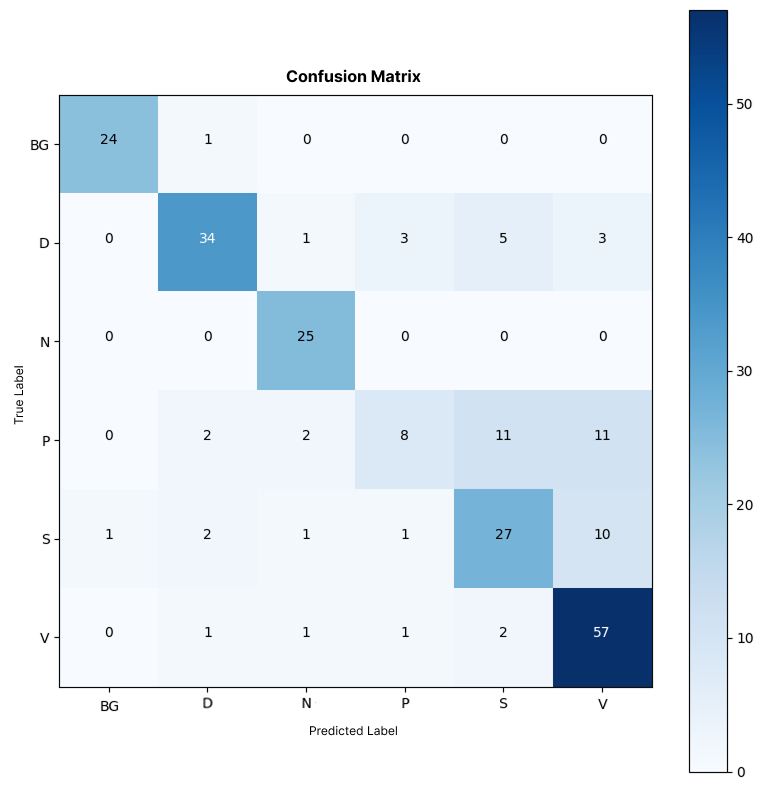 | 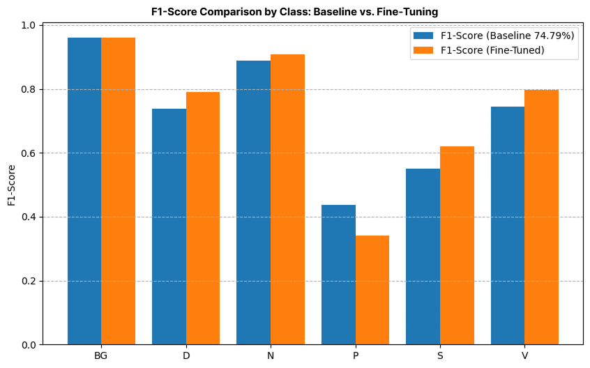 |

## 📱 Platform Demonstration

The interface is designed for point-of-care usability, allowing clinicians to register patients, upload images, and interact with the AI-generated narratives.

### Narrative Interpretability Layer

Rather than providing a "black-box" classification, the system uses Google Gemini to translate probabilistic distributions and patient metadata into editable clinical drafts. These reports explicitly highlight model uncertainties and suggest differential probabilities to ensure human-in-the-loop safety.

| Patient Registration | LLM Interpretability Interface |
| :--- | :--- |
| 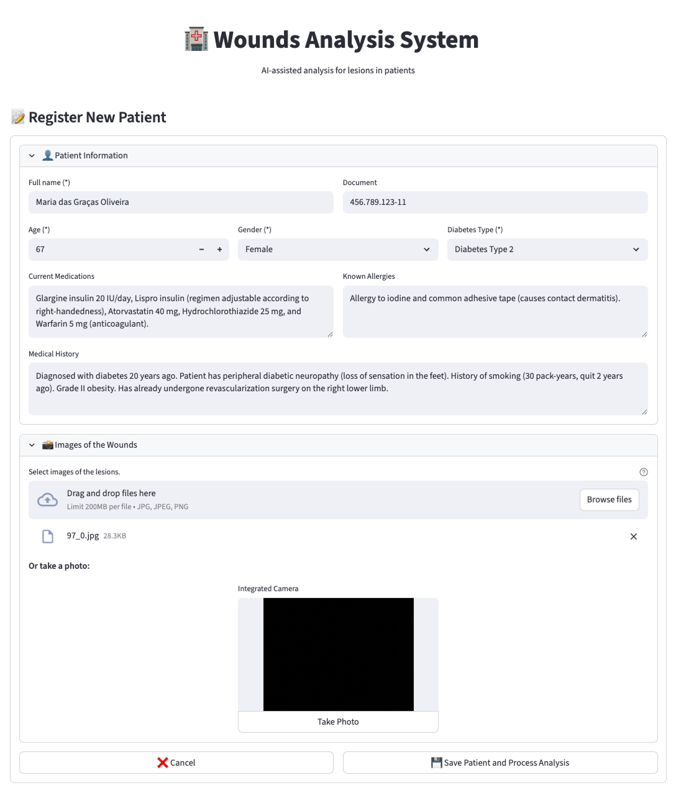 | 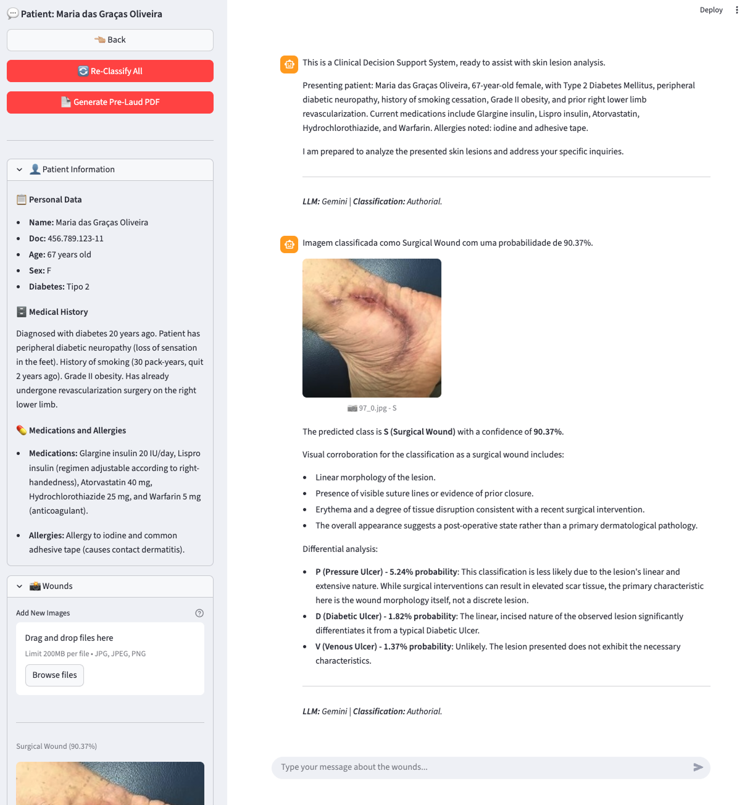 |
| Ingestion modules allow for structured clinical data alongside high-resolution uploads. | Interactive templates contextualize model uncertainty for human verification. |

## 👥 Authors

The research was conducted through a partnership between authors from the **Federal University of Rio Grande do Norte (UFRN)** and the **Northeast Center for Strategic Technologies (CETENE)**.

|  |  |  |
| :--- | :--- | :--- |
|  | 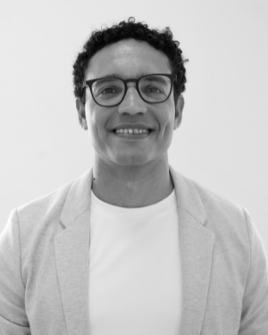 |  |
| **Ernane Ferreira Rocha Junior** | **Ignacio Sánchez-Gendriz** | **Luiz Affonso Guedes** |
| Received the technical degree in Electronics from the Digital Metropolis Institute (IMD) in 2019, the B.S. degree in Science and Technology in 2023, and the B.S. degree in Computer Engineering in 2026, all from the Federal University of Rio Grande do Norte (UFRN), Brazil. He is currently pursuing the M.Sc. degree in Electrical and Computer Engineering through the Graduate Program in Electrical and Computer Engineering (PPgEEC) at UFRN. His research interests include artificial intelligence, large language models (LLMs), intelligent agents, seismic data analysis, and software engineering. | Received his B.S. (2006) and M.Sc. (2012) degrees in Automatic Engineering from Universidad de Oriente, Cuba, and the Ph.D. degree (2017) in Mechanical Engineering from the Polytechnic School of the University of São Paulo (USP), Brazil. He completed a postdoctoral fellowship at the Federal University of Rio Grande do Norte (UFRN), applying digital signal processing, machine learning, and artificial intelligence to a range of applications, including neuroscience and seismic signal analysis. He is currently a researcher at the Ministry of Science, Technology, and Innovation (MCTI), based at the Center for Strategic Technologies of the Northeast (CETENE), where he works in scientific computing. His research interests include emerging AI technologies, large language models (LLMs), and applied data science.  | Received the degree in electrical engineering from the Federal University of Pará (UFPA), Brazil, in 1987, and the Ph.D. degree in automation and computer engineering from the State University of Campinas (Unicamp), Brazil, in 1999. He is currently a Full Professor with the Department of Computer Engineering and Automation (DCA), Federal University of Rio Grande do Norte (UFRN), Brazil. His research interests include data science and machine learning, particularly in the use of statistical models, incremental learning, and evolving systems, with a strong emphasis on industrial applications. With over 20 years of experience leading research and development projects, he has contributed to the development of numerous software-based solutions for industrial challenges. |

## 📄 Citation

If you use this work in your research, please cite our official paper:

```bibtex
@article{rocha2026interpretable,
  title={An AI-Enabled Digital Healthcare Workflow: Integrating Deep Learning and Large Language Models for Interpretable Wound Triage},
  author={ROCHA JUNIOR, Ernane Ferreira and SÁNCHEZ-GENDRIZ, Ignacio and GUEDES, Luiz Affonso},
  journal={},
  year={2026},
  volume={XX},
  number={XX},
  doi={XXXXXXX}
}
```

## 🎥 Video Abstract

Watch the detailed explanation of the project on [YouTube](https://youtu.be/c40LVmmnLq8):

[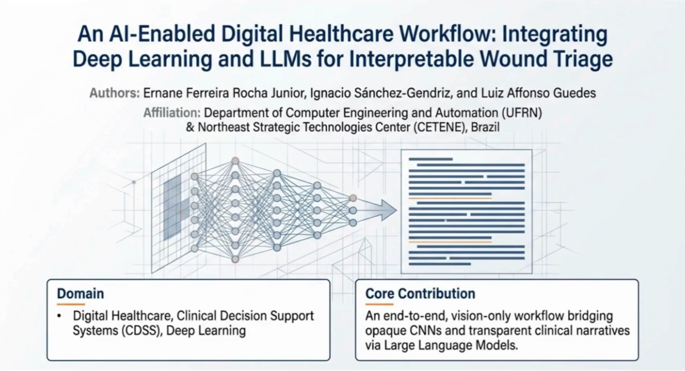](https://youtu.be/c40LVmmnLq8)